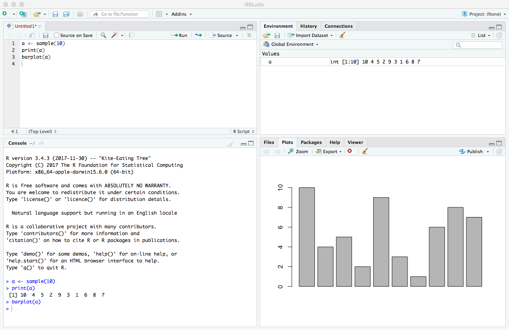

```{r include=F}
options(repos = c(CRAN = 'https://cran.rstudio.com'))
```

# Introduction {#intro}

This book introduces into using R for data mining. It presents many examples of various data mining functionalities in R and three case studies of real world applications. The supposed audience of this book are postgraduate students, researchers, data miners and data scientists who are interested in using R to do their data mining research and projects. We assume that readers already have a basic idea of data mining and also have some basic experience with R. We hope that this book will encourage more and more people to use R to do data mining work in their research and applications.

This chapter introduces basic concepts and techniques for data mining, including a data mining process and popular data mining techniques. It also presents R and its packages, functions and task views for data mining. At last, some datasets used in this book are described.


## Data Mining

Data mining \index{data mining} is the process to discover interesting knowledge from large amounts of data [@Han00Data]. It is an interdisciplinary field with contributions from many areas, such as statistics, machine learning, information retrieval, pattern recognition and bioinformatics. Data mining is widely used in many domains, such as retail, finance, telecommunication and social media.

The main techniques for data mining include classification and prediction, clustering, outlier detection, association rules, sequence analysis, time series analysis and text mining, and also some new techniques such as social network analysis and sentiment analysis. Detailed introduction of data mining techniques can be found in text books on data mining [@Han00Data,@Hand01Principles,@Witten05Data]. In real world applications, a data mining process can be broken into six major phases: business understanding, data understanding, data preparation, modeling, evaluation and deployment, as defined by the CRISP-DM (Cross Industry Standard Process for Data Mining) \<http://www.crisp-dm.org/>. This book focuses on the modeling phase, with data exploration and model evaluation involved in some chapters. Readers who want more information on data mining are referred to online resources in \autoref{ch:resources}.


## R

R \index{R} \<http://www.r-project.org/> [@RCoreTeam15R] is a free software environment for statistical computing and graphics. It provides a wide variety of statistical and graphical techniques. R can be easily extended with `r nrow(available.packages())` packages available on CRAN \<http://cran.r-project.org/> (as of `r format(Sys.Date(), format="%d %B %Y")`). In addition, there are many packages provided on other websites, such as Bioconductor \<http://www.bioconductor.org/>, and also a lot of packages under development at R-Forge \<http://r-forge.r-project.org/> and GitHub \<https://github.com/>. More details about R are available in \textit{An Introduction to R}  \<http://cran.r-project.org/doc/manuals/R-intro.pdf> [@R15Introduction] and \textit{R Language Definition}  \<http://cran.r-project.org/doc/manuals/R-lang.pdf> [@RCoreTeam15RLanguage] at the CRAN website. R is widely used in both academia and industry.


To help users to find our which R packages to use, the CRAN Task Views \<http://cran.r-project.org/web/views/> are a good guidance. They provide collections of packages for different tasks. Some Task Views related to data mining are: 

- Machine Learning \& Statistical Learning,
- Cluster Analysis \& Finite Mixture Models, 
- Time Series Analysis,
- Natural Language Processing,
- Multivariate Statistics, and 
- Analysis of Spatial Data. 
 

Another guide to R for data mining is an *R Reference Card for Data Mining* (see \autopageref{ch:refcard}), which provides a comprehensive indexing of R packages and functions for data mining, categorized by their functionalities. Its latest version is available at http://www.rdatamining.com/docs and http://www2.rdatamining.com/.

Readers who want more information on R are referred to online resources in \autoref{ch:resources}.


### R Basics

Please refer to *An Introduction to R* [@R15Introduction] for an introduction to basics of R.


### RStudio
RStudio \<http://www.rstudio.com/> is an integrated development environment (IDE) for R and can run on various operating systems like Windows, Mac OS X and Linux. It is a very useful and powerful tool for R programming, and therefore, readers are suggested to use RStudio when learning from this book or doing their projects, although all the provided code can run without it. What you normally need is RStudio Desktop open source edition, which is free of charge.

When RStudio is launched for the first time, you can see a window similar to Figure \ref{fig:intro:rstudio}. There are four panels:

- Source panel (top left), which shows your R source code. If you cannot see the source panel, you can find it by clicking menu "File", "New File" and then "R Script". You can run a line or a selection of R code by clicking the "Run" bottom on top of source panel, or pressing "Ctrl + Enter".
- Console panel (bottom left), which shows outputs and system messages displayed in a normal R console;
- Environment/History/Presentation panel (top right), whose three tabs show respectively all objects and function loaded in R, a history of submitted R code, and Presentations generated with R; 
- Files/Plots/Packages/Help/Viewer panel (bottom right), whose tabs show respectively a list of files, plots, R packages installed, help documentation and local web content.





It is always a good practice to begin R programming with an RStudio project, which is a folder where to put your R code, data files and figures. To create a new project, click
the "Project" button at the top-right corner and then choose "New Project". After that, select "create project from new directory" and then "Empty Project". After typing a directory name, which will also be your project name, click "Create Project" to create your project folder and files. If you open an existing project, RStudio will automatically set the working directory to the project directory, which is very convenient. After that, create three folders as below:

- *code*, where to put your R souce code;
- *data*, where to put your datasets; and
- *figures*, where to put produced diagrams.

In addition to above three folders which are usesul to most projects, depending on your project and preference, you may create additional folders below:

- *rawdata*, where to put all raw data,
- *models*, where to put all produced analytics models, and 
- *reports*, where to put your analysis reports.


## Datasets

Some datasets used in this book are briefly described in this section.

### The Iris Dataset \label{sec:intro:data:iris}
The \code{iris} dataset has been used for classification in many research publications. It consists of 50 samples from each of three classes of iris flowers \cite{Frank10UCI}. One class is linearly separable from the other two, while the latter are not linearly separable from each other. There are five attributes in the dataset:

- sepal length in cm,
- sepal width in cm, 
- petal length in cm, 
- petal width in cm, and 
- class: Iris Setosa, Iris Versicolour, and Iris Virginica.

Detailed desription of the dataset and research publications citing it can be found at the UCI Machine Learning Repository \<https://archive.ics.uci.edu/ml/datasets/Iris>.

Below we have a look at the structure of the dataset with \func{str()}. Note that all variable names, package names and function names in R are case sensitive. 
```{r}
str(iris)
```
From the output, we can see that there are 150 observations (records, or rows) and 5 variables (or columns) in the dataset. The first four variables are numeric. The last one, \code{Species}, is categoric (called as ``factor" in R) and has three levels of values.


### The Bodyfat Dataset \label{sec:intro:data:bodyfat}
\code{Bodyfat} is a dataset available in package \pack{TH.data}\cite{Hothorn15THdata:}. It has 71 rows, and each row contains information of one person. It contains the following 10 numeric columns.

- \code{age}: age in years.
- \code{DEXfat}: body fat measured by DXA, response variable.
- \code{waistcirc}: waist circumference.
- \code{hipcirc}: hip circumference.
- \code{elbowbreadth}: breadth of the elbow.
- \code{kneebreadth}: breadth of the knee.
- \code{anthro3a}: sum of logarithm of three anthropometric measurements.
- \code{anthro3b}: sum of logarithm of three anthropometric measurements.
- \code{anthro3c}: sum of logarithm of three anthropometric measurements.
- \code{anthro4}: sum of logarithm of three anthropometric measurements.

The value of \code{DEXfat} is to be predicted by the other variables.

```{r}
data("bodyfat", package = "TH.data")
str(bodyfat)
```


